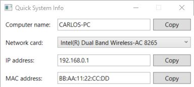

# Quick System Info

A small Windows utility to get Networking and System information. Provides the ability to easily copy the values to clipboard.  

## Features

* Portable (No installation required)
* Small footprint
* Copy to clipboard
* Multiple language support (English, Spanish)

## Downloads

[Version v0.2](https://github.com/Carlos487/QuickSystemInfo/releases/tag/v0.2)

## Requirements

* .Net Framework 4.6.1

## Author

* Carlos Fabara @carlos487

## License

This project is licensed under the MIT License - see the [LICENSE](LICENSE) file for details